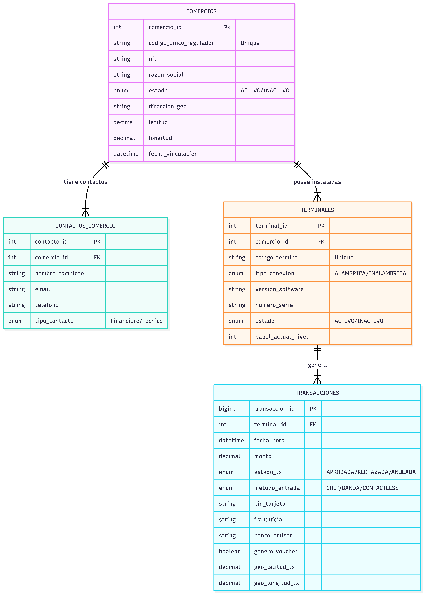
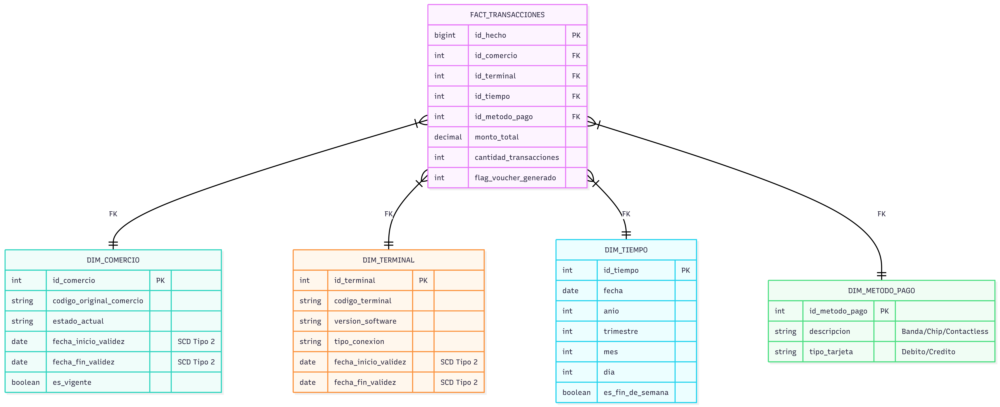
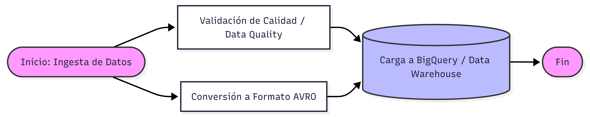
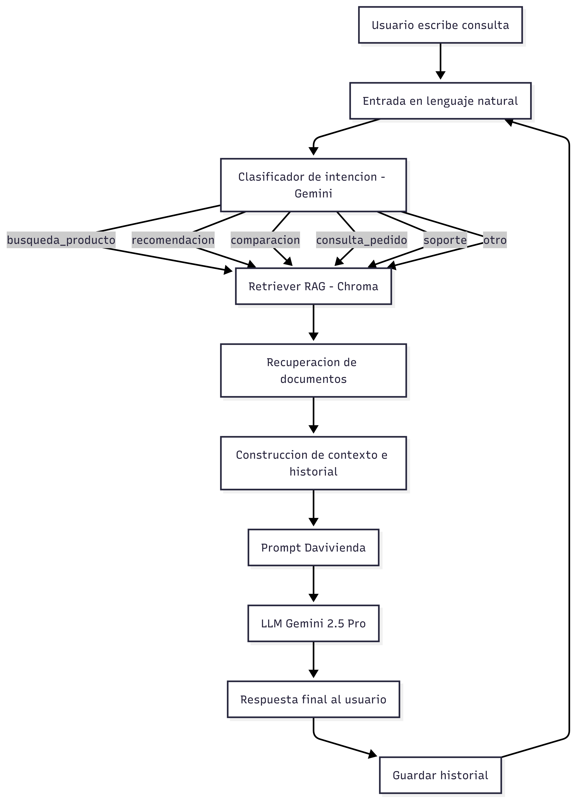

# Prueba Técnica: Profesional II Analítica Predictiva - Hub de Datos

Este repositorio contiene la solución completa a la prueba técnica para el rol de Analítica Predictiva / Ingeniería de Datos. A continuación, se detalla el diseño de los modelos de datos, las consultas SQL, los scripts en Python y la justificación teórica de los conceptos de GCP e Ingeniería de Datos.

## Tabla de Contenidos
1. [Modelo de Datos Relacional (OLTP)](#1-modelo-de-datos-relacional-oltp)
2. [Modelo de Datos Dimensional (OLAP) y SQL](#2-modelo-de-datos-dimensional-olap-y-sql)
3. [Scripting Python (Conversión a AVRO)](#3-scripting-python-conversión-a-avro)
4. [Conceptos de Dataproc](#4-dataproc-vs-dataproc-serverless)
5. [Orquestación con DAGs](#5-definición-y-diagrama-de-dag)
6. [Metodologías ETL vs ELT](#6-etl-vs-elt)
7. [Curaduría de Datos](#7-actividades-de-curaduría-de-datos)

---

## 1. Modelo de Datos Relacional (OLTP)

**Objetivo:** Diseñar un esquema para un sistema transaccional de alto rendimiento (tiempos de respuesta en milisegundos) que gestione comercios, terminales y transacciones.

### Descripción de la Solución
Se diseñó un modelo en **Tercera Forma Normal (3NF)** para asegurar la integridad de los datos y reducir la redundancia.
* **Comercios:** Entidad central identificada por NIT y Código Único.
* **Terminales:** Dispositivos asociados a comercios, con control de inventario (papel) y estado.
* **Transacciones:** Registro detallado de cada operación monetaria, vinculando medios de pago y ubicación geográfica.

### Diagrama Físico



## 2. Modelo de Datos Dimensional (OLAP) y SQL

**Objetivo:** Diseñar un modelo para responder preguntas de negocio y calcular KPIs.

### Descripción de la Solución

Se utilizó un **Esquema en Estrella (Star Schema)** centrado en la tabla de hechos `FACT_TRANSACCIONES`, rodeada de dimensiones clave (`DIM_COMERCIO`, `DIM_TERMINAL`, `DIM_TIEMPO`, `DIM_METODO_PAGO`).

Se aplicó lógica de **SCD Tipo 2 (Slowly Changing Dimensions)** en las dimensiones de Comercios y Terminales para rastrear cambios históricos de estado, versiones y atributos relevantes, garantizando trazabilidad temporal y consistencia analítica.


### Diagrama Dimensional



## Consultas SQL (GoogleSQL Dialect)

### a. Clientes activos y promedio de terminales
```sql
SELECT
  COUNT(DISTINCT c.id_comercio) AS clientes_activos,
  COUNT(DISTINCT t.id_terminal) / NULLIF(COUNT(DISTINCT c.id_comercio), 0) AS avg_terminales_cliente
FROM `DIM_COMERCIO` c
JOIN `DIM_TERMINAL` t ON c.id_comercio = t.id_comercio
WHERE c.estado = 'ACTIVO' AND t.estado = 'ACTIVO';
```

### b. Valor promedio de transacciones por terminal activa
```sql
SELECT
  t.codigo_terminal,
  AVG(f.monto_total) AS valor_promedio_tx
FROM `FACT_TRANSACCIONES` f
JOIN `DIM_TERMINAL` t ON f.id_terminal = t.id_terminal
WHERE t.estado = 'ACTIVO'
GROUP BY t.codigo_terminal;
```

### c. Terminales con consumo de papel > 50% (Alerta)
```sql
WITH conteo_papel AS (
    SELECT id_terminal, COUNT(*) AS tx_count
    FROM `FACT_TRANSACCIONES`
    GROUP BY id_terminal
)
SELECT id_terminal 
FROM conteo_papel 
WHERE MOD(tx_count, 5) >= 3; -- 3 txs es >50% de capacidad de 5
```

### d. Recurrencia de tarjetas usando 'Banda'
```sql
SELECT
  f.hash_tarjeta,
  COUNT(*) as recurrencia
FROM `FACT_TRANSACCIONES` f
JOIN `DIM_METODO_PAGO` m ON f.id_metodo_pago = m.id_metodo
WHERE m.descripcion = 'BANDA'
GROUP BY f.hash_tarjeta
ORDER BY recurrencia DESC
LIMIT 10;
```

### e. Clientes que cambiaron de Activo a Inactivo
```sql
SELECT COUNT(DISTINCT id_comercio) as cambios_activo_inactivo
FROM `DIM_COMERCIO`
WHERE estado = 'INACTIVO' AND estado_previo = 'ACTIVO';
```

### f. Transacciones anómalas (Comercio Inactivo)

```sql
SELECT DISTINCT t.codigo_terminal
FROM `FACT_TRANSACCIONES` f
JOIN `DIM_COMERCIO` c ON f.id_comercio = c.id_comercio
WHERE c.estado = 'INACTIVO'
  AND f.fecha_id BETWEEN c.fecha_inicio_validez AND c.fecha_fin_validez;
```

### g. Cambios de versión en el último trimestre
```sql
SELECT count(*) as cambios_version
FROM `DIM_TERMINAL`
WHERE fecha_inicio_validez >= DATE_SUB(CURRENT_DATE(), INTERVAL 3 MONTH)
  AND version_software != version_software_previa;
```

## 3. Scripting Python (Conversión a AVRO)

Script para generar archivos en formato AVRO basados en las alertas de los puntos 2c y 2f.
``` Python

import fastavro
from datetime import datetime

### Definición del esquema AVRO
schema = {
    "doc": "Alertas de Terminales",
    "name": "AlertaTerminal",
    "namespace": "com.hubdatos.analytics",
    "type": "record",
    "fields": [
        {"name": "codigo_terminal", "type": "string"},
        {"name": "tipo_alerta", "type": "string"}, 
        {"name": "fecha_evento", "type": "string"},
        {"name": "detalle", "type": "string"}
    ]
}

# Datos de ejemplo (Simulación de salida SQL)
datos = [
    {
        "codigo_terminal": "TERM-001",
        "tipo_alerta": "PAPEL_BAJO",
        "fecha_evento": datetime.now().isoformat(),
        "detalle": "Consumo > 50%"
    },
    {
        "codigo_terminal": "TERM-999",
        "tipo_alerta": "FRAUDE_POSIBLE",
        "fecha_evento": datetime.now().isoformat(),
        "detalle": "Tx en comercio Inactivo"
    }
]

with open('alertas.avro', 'wb') as out:
    fastavro.writer(out, schema, datos)
```

## 4. Dataproc vs. Dataproc Serverless

| Característica | Dataproc Standard (Clusters) | Dataproc Serverless |
|---------------|------------------------------|---------------------|
| Administración | El usuario gestiona nodos (Master/Workers), tipos de máquina y escalado. | Google gestiona la infraestructura completamente. |
| Caso de uso | Cargas constantes (24/7), control fino de configuración Spark/Hadoop, tuning específico. | Jobs esporádicos, pipelines ETL ad-hoc, equipos sin experiencia en Ops. |
| Facturación | Por tiempo de actividad del clúster (aunque esté inactivo). | Por tiempo de ejecución real del script (vCPU/Hora). |
| Inicio | Tiempo de aprovisionamiento (~90 seg a minutos). | Inicio casi instantáneo bajo demanda. |

## 5. Definición y Diagrama de DAG

Un DAG (Directed Acyclic Graph) es un grafo dirigido que no tiene ciclos. En ingeniería de datos (ej. Airflow), representa un flujo de trabajo donde los nodos son tareas y las aristas son dependencias. El flujo siempre avanza y nunca regresa a una tarea anterior en un bucle infinito.

### Diagrama de Flujo del DAG



## 6. ETL vs ELT

Se prefiere **ETL (Extract, Transform, Load)** sobre **ELT** en los siguientes casos:

- **Seguridad y Compliance (PII):**  
  Cuando es obligatorio limpiar, enmascarar o eliminar datos sensibles (tarjetas de crédito, nombres reales) **antes** de que estos lleguen al almacenamiento en la nube o al Data Warehouse.

- **Carga computacional:**  
  Cuando las transformaciones son extremadamente complejas y es más eficiente procesarlas en memoria (Spark / Python) que sobrecargar el motor de base de datos de destino.

- **Costos de almacenamiento:**  
  Cuando se desea reducir costos almacenando únicamente los datos finales procesados y no la data cruda (*raw*).

## 7. Actividades de Curaduría de Datos

La curaduría de datos asegura la disponibilidad, confiabilidad y calidad de los datos para su consumo analítico.  
Las actividades principales incluyen:

- **Perfilamiento (Profiling):**  
  Diagnóstico inicial para comprender la estructura de los datos, identificar valores nulos, rangos, duplicados y distribuciones.

- **Limpieza (Cleansing):**  
  Corrección de errores tipográficos, estandarización de formatos (fechas, monedas, identificadores) e imputación o eliminación controlada de valores faltantes.

- **Validación de reglas de negocio:**  
  Verificación de coherencia lógica y semántica (por ejemplo, `fecha_fin` no puede ser menor que `fecha_inicio`).

- **Enriquecimiento:**  
  Agregado de valor mediante el cruce con fuentes internas o externas (georreferenciación, información demográfica, segmentación).

- **Catalogación y linaje:**  
  Documentación del origen del dato, transformaciones aplicadas, frecuencia de actualización y responsables, facilitando la gobernanza y auditoría.

### Arquitectura del Agente coversacional 


